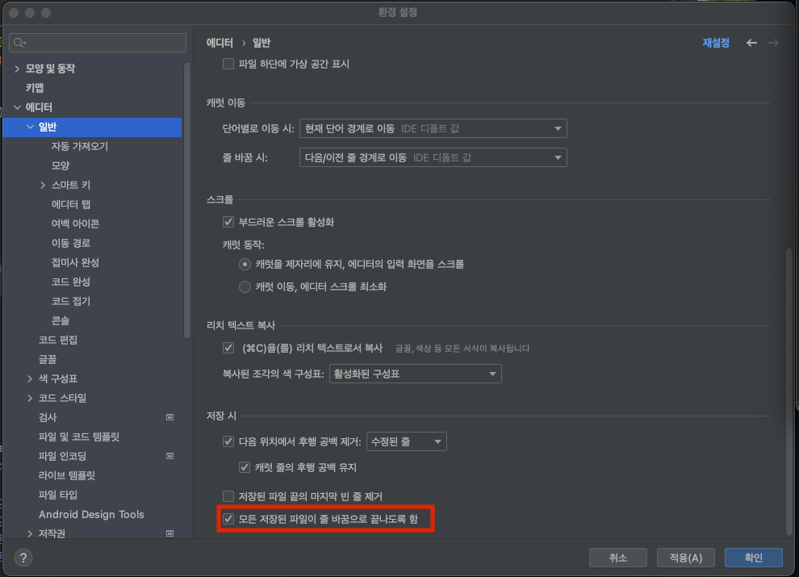

github에서 다음과 같은 eol 경고가 발생하곤 합니다.

파일 마지막에 빈 줄이 있어야 한다는 경고인 것입니다.  
이런 경고를 막기 위해 매번 파일을 올릴 때마다 모든 파일의 마지막 줄을 살펴봐야 한다거나  
저 부분만 고치는 커밋을 올리는 것은 근본적인 해결이 아닐뿐더러 귀찮은 일일 것입니다.

다행히 intellij idea에는 해당 작업을 자동으로 해 주는 옵션이 존재합니다.

  
설정(Preference) --> 에디터 --> 일반 --> "모든 저장된 파일이 줄 바꿈으로 끝나도록 함" 체크  

이제 파일을 저장할 때마다 마지막에 빈 줄을 추가해 줍니다.
